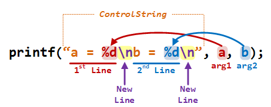
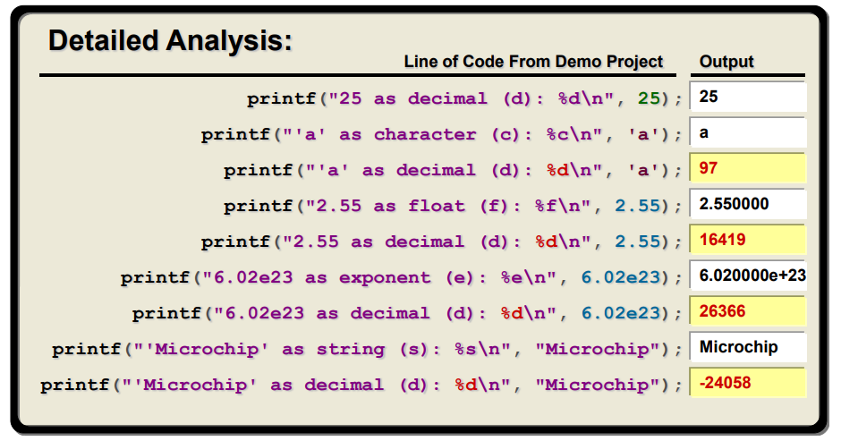

# Usar_C18_Native
> Ejemplo de uso de la librería "usart.h".
> modo nativo; con el Pic **18F4620**
> 
 por: Rommel Contreras - _rommeljose@gmail.com_

> Este programa, permite la exploración y uso de la librería usart.h del compilador C18 (MPLAB® C18); de uso general para la familia de
> microcontroladores PIC18xxx.
> El programa se desarrollo como plataforma para paracticar las utilidades de impresión o salida al puerto serial, tales como:

> Esto requiere del uso y configuración de un Puerto Serial, basada en un módulo UART del Pic utilizado. 
>> **ver:** [MPLAB_C18_Libraries_51297e.pdf](MPLAB_C18_Libraries_51297e.pdf)

>> El propósito de esta práctica de laboratorio es ilustrar el uso de la función de biblioteca C estándar printf() . Dado que su propósito original era imprimir texto en el dispositivo de salida estándar de una computadora (pantalla de monitor o impresora),

Uso del printf ---> 

## Funciones que tienen salida por el puerto serial:

`fprintf`	Salida de cadena formateada a un stream.

`fputs` Salida de cadena a un stream.

`printf` Salida de cadena formateada al stdout.

`putc` Salida de carácter a un stream.

`puts` Secuencia de salida de cadena al stdout.

`sprintf` Salida de cadena formateada a un buffer de la memoria de datos.

`vfprintf` Salida de cadena formateada a un stream con los argumentis para procesar la cadena de formato  proporcionada a través de la función stdarg.

`vprintf` Salida de cadena formateada al stdout con los argumentis para procesar la cadena de formato  proporcionada a través de la función stdarg.

`vsprintf` Salida de cadena formateada a un buffer de la memoria de datos con los argumentis para procesar la cadena de formato  proporcionada a través de la función stdarg.

`_usart_put`c Salida de un solo carácter al USART (USART1 para los dispositivos que tienen más de un USART).

`_user_putc` Salida de un solo carácter de una manera definida por la aplicación.

Ejemplos printf ---> 

## Especificadores de formatos:

%c	Single character

%s	String (all characters until '\0')

%d	Signed decimal integer

%o	Unsigned octal integer

%u	Unsigned decimal integer

%x	Unsigned hexadecimal integer with lower case digits (e.g. 1a5e)

%X	Same as %x but with upper case digits (e.g. 1A5E)

%f	Signed decimal value (floating point)

%e	Signed decimal value with exponent (e.g. 1.26e-5)

%E	Same as %e but uses upper case E for exponent (e.g. 1.26E-5)

%g	Same as %e or %f, depending on size and precision of value

%G	Same as %g but will use capital E for exponent

>> **ver:** [The printf() Function](https://microchipdeveloper.com/tls2101:printf))
